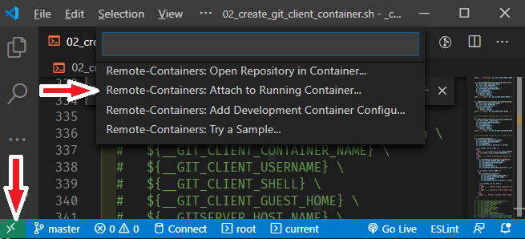
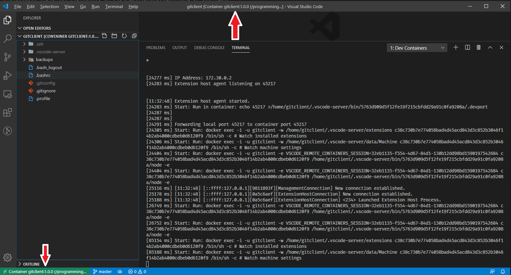
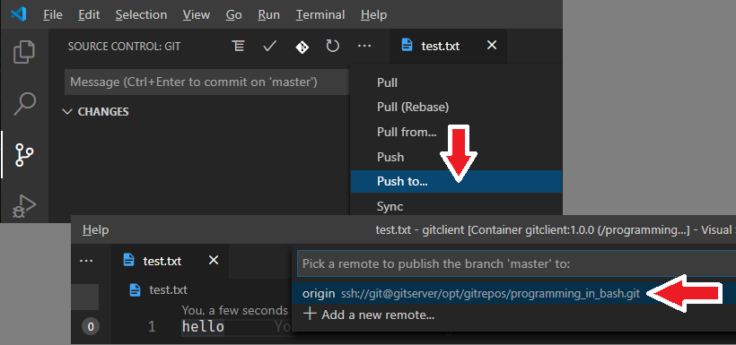

# Git Docker Container for VS Code Remote Container development

<!-- TOC -->

- [Git Docker Container for VS Code Remote Container development](#git-docker-container-for-vs-code-remote-container-development)
  - [Introduction](#introduction)
  - [Docker Container and VS Code setup workflow](#docker-container-and-vs-code-setup-workflow)
  - [AA](#aa)
  - [Assumed host environment](#assumed-host-environment)
  - [Assumed execution environment](#assumed-execution-environment)
  - [Installation](#installation)
  - [Create and Run Docker Container: 02_create_git_client_container](#create-and-run-docker-container-02_create_git_client_container)
    - [Customisation](#customisation)
    - [Script invocation](#script-invocation)
      - [Host-Guest-Shared "backups" directory](#host-guest-shared-backups-directory)
      - [Custom Git commands accepted by the client over SSH](#custom-git-commands-accepted-by-the-client-over-ssh)
  - [Create Remote Git Repository: 03_create_named_repo_in_private_gitserver.sh](#create-remote-git-repository-03_create_named_repo_in_private_gitserversh)
    - [Script invocation](#script-invocation-1)
  - [Delete Empty Remote Repository: 04_DeleteRemoteRepoIfEmpty](#delete-empty-remote-repository-04_deleteremoterepoifempty)
    - [Script invocation](#script-invocation-2)
    - [Note about removal of Non-empty Repository](#note-about-removal-of-non-empty-repository)
  - [Add WSL public key to gitserever's authorized_keys: 05_AddWSLClientSSHKeyToGitserver_authorized_keys](#add-wsl-public-key-to-gitserevers-authorized_keys-05_addwslclientsshkeytogitserver_authorized_keys)
    - [Note](#note)
    - [Script invocation](#script-invocation-3)
  - [Create Remote Git Repository: 03_create_named_repo_in_private_gitserver.sh](#create-remote-git-repository-03_create_named_repo_in_private_gitserversh-1)
    - [Script invocation](#script-invocation-4)
  - [Set up container for remote development: 06_set_up_container_for_remote_dev.sh](#set-up-container-for-remote-development-06_set_up_container_for_remote_devsh)
    - [Script invocation](#script-invocation-5)
  - [Update Container and create VS Code invocation shortcuts: 07_UpdateContainerSetupAfterFirstCodeRun.sh](#update-container-and-create-vs-code-invocation-shortcuts-07_updatecontainersetupafterfirstcoderunsh)
    - [Script invocation](#script-invocation-6)
  - [Unit Tests](#unit-tests)
  - [Licensing](#licensing)
  - [Note](#note-1)

<!-- /TOC -->

<!--

mcz@mcz10:/mnt/d/github_materials/programming_in_bash/_commonUtils$ ./04_DeleteRemoteRepoIfEmpty.sh -f yes
\_??\_ Use default name 'programming_in_bash' as Remote Git Repository name?  (y/N) y
____ Will use 'programming_in_bash' as the name of the remote git repository which to delete
____ Input accepted as 'programming_in_bash'
____ Client authorised to interact with the server
programming_in_bash
____ Repository 'programming_in_bash' exists
____ Non-empty repository 'programming_in_bash' will be deleted
____ Repository 'programming_in_bash' deleted

 -->

<!--

mcz@mcz10:/mnt/d/github_materials/programming_in_bash/_commonUtils$ ./02_create_git_client_container.sh -g yes
____ Set environment variables
____ Will include support for private git server integration
\_??\_ Create remote git repository if it does not exist?  (y/N) y
\_??\_ Use default name 'programming_in_bash' as Remote Git Repository name?  (y/N) y
____ Will use 'programming_in_bash' as the name of the remote git repository which to create
\_??\_ Project Directory is /mnt/d/github_materials/programming_in_bash, Project Name is 'programming_in_bash' - Is this correct? (y/N) y
\_??\_ Use default name 'programming_in_bash' as container name?  (y/N) y
____ Using 'programming_in_bash' as Container Name and Host Name
\_??\_ Create Windows Shortcuts? (y/N) y
____ Will create windows shortcuts
____ Created '/mnt/d/github_materials/programming_in_bash/docker-compose.yml_programming_in_bash'
____ Image 'gitclient:1.0.0' exist
Creating programming_in_bash ... done
____ Container' programming_in_bash' started
____ Generated '/home/gitclient' ssh keypair
____ Added '/home/gitclient' public key to 'gitserver' ~/.ssh/authorised_keys
____ Added 'gitserver' to '/home/gitclient' ${HOME}/.ssh/known_hosts
____ Added 'programming_in_bash' to '/home/gitclient' ${HOME}/.ssh/known_hosts
Initialized empty Git repository in /opt/gitrepos/programming_in_bash.git/
programming_in_bash
____ Created remote repository 'programming_in_bash'
____ Created Windows Shortcuts
____ ./02_create_git_client_container.sh Done

-->

<!--

mcz@mcz10:/mnt/d/github_materials/programming_in_bash/_commonUtils$ ./06_set_up_container_for_remote_dev.sh
\_??\_ Artefact location will be '/mnt/d/github_materials/programming_in_bash' - Is this correct? (y/N) y
____ Container 'programming_in_bash' exists and is running
____ Set up startup project directory in remote environment
____ Created .gitignore in remote environment
[master (root-commit) d8a17bd] initial commit
 5 files changed, 184 insertions(+)
 create mode 100644 .bash_logout
 create mode 100644 .bashrc
 create mode 100644 .gitignore
 create mode 100644 .profile
 create mode 100644 backups/programming_in_bash.txt
____ Initialised git repository in remote environment
____ Container set up

-->

<!--

Start remote vscode from local vscode
Let remote vscode perform support software installation
Leave remote container running  and run ./07_UpdateContainerSetupAfterFirstCodeRun.sh

./VSCode-Remote-Containers-Attach-to-Running-Container.png'

 -->

<!--

mcz@mcz10:/mnt/d/github_materials/programming_in_bash/_commonUtils$ ./07_UpdateContainerSetupAfterFirstCodeRun.sh
____________Created/Updated script and windows shortcut to run VSCode with resources in the 'programming_in_bash' container

 -->

## Introduction

I find VS Code to be a great free development editor and since my activities involve a deal of development for the Linux platform. I like to be able to run the editor on Windows and build and run in the target environments using Docker as means to spin up lightweight containers for different projects with different technology stacks.

Scripts in this package facilitate creation of a Docker Container, based on the docker image created using scripts in the package [Git Client Docker Container](https://github.com/mwczapski/git_client_docker_container), with a Git Client that you can choose to configure to work in ocnjunction with the [Private GIT Server](https://github.com/mwczapski/private_gitserver_docker_container). This container can be configured to work as a remote container environment for VS Code development on Windows.

[Top](#git-docker-container-for-vs-code-remote-container-development)

## Docker Container and VS Code setup workflow

## AA

The following steps will guide the setup of the environment in wich to undertake Windows' VS Code development using a Docker Container as the host for artifacts and execution exnvironment, including integration between the container and the Provate Git Repository.

0. Optionally, execute `04_DeleteRemoteRepoIfEmpty.sh -f yes` to remove the remote git repository if you created one in an earlier attempt and wish to get rid of it and start again. `/02_create_git_client_container.sh -g yes` will not remove or attempt to re-initialise a git repository if it finds one.

   The following transcript is an example of the interaction:

   <code>
   cd /mnt/d/github\*materials/programming\*in_bash/\_commonUtils\</code> <code>
   ./04_DeleteRemoteRepoIfEmpty.sh -f yes</code> <code>
   _??_ Use default name 'programming_in_bash' as Remote Git Repository name? (y/N) y</code> <code>
   ____ Will use 'programming_in_bash' as the name of the remote git repository which to delete</code> <code>
   ____ Input accepted as 'programming_in_bash'</code> <code>
   ____ Client authorised to interact with the server</code> <code>
   programming_in_bash</code> <code>
   ____ Repository 'programming_in_bash' exists</code> <code>
   ____ Non-empty repository 'programming_in_bash' will be deleted</code> <code>
   ____ Repository 'programming_in_bash' deleted</code>
    
    

1) Execute `02_create_git_client_container.sh -g yes` to create and set up a container with Private Git Repository integration if you desire such integration and have the gitserver container running. 
   Alternatively, execute `02_create_git_client_container.sh` if you do not with Private Got server integration. Git client is still available but you will need to manually configure any remote repositories which you wish to use, perhaps only in the VS Code IDE.

   The following transcript is an example of the interaction:

  <code>
   cd /mnt/d/github_materials/programming_in_bash/_commonUtils</code> <code>
   ./02_create_git_client_container.sh -g yes</code> <code>
   ____ Set environment variables</code> <code>
   ____ Will include support for private git server integration</code> <code>
   _??_ Create remote git repository if it does not exist?  (y/N) y</code> <code>
   _??_ Use default name 'programming_in_bash' as Remote Git Repository name?  (y/N) y</code> <code>
   ____ Will use 'programming_in_bash' as the name of the remote git repository which to create</code> <code>
   _??_ Project Directory is /mnt/d/github_materials/programming_in_bash, Project Name is 'programming_in_bash' - Is this correct? (y/N) y</code> <code>
   _??_ Use default name 'programming_in_bash' as container name?  (y/N) y</code> <code>
   ____ Using 'programming_in_bash' as Container Name and Host Name</code> <code>
   _??_ Create Windows Shortcuts? (y/N) y</code> <code>
   ____ Will create windows shortcuts</code> <code>
   ____ Created '/mnt/d/github_materials/programming_in_bash/docker-compose.yml_programming_in_bash'</code> <code>
   ____ Image 'gitclient:1.0.0' exist</code> <code>
   Creating programming_in_bash ... done</code> <code>
   ____ Container' programming_in_bash' started</code> <code>
   ____ Generated '/home/gitclient' ssh keypair</code> <code>
   ____ Added '/home/gitclient' public key to 'gitserver' ~/.ssh/authorised_keys</code> <code>
   ____ Added 'gitserver' to '/home/gitclient' ${HOME}/.ssh/known_hosts</code> <code>
   ____ Added 'programming_in_bash' to '/home/gitclient' ${HOME}/.ssh/known_hosts</code> <code>
   Initialized empty Git repository in /opt/gitrepos/programming_in_bash.git/</code> <code>
   programming_in_bash</code> <code>
   ____ Created remote repository 'programming_in_bash'</code> <code>
   ____ Created Windows Shortcuts</code> <code>
   ____ ./02_create_git_client_container.sh Done</code>
    
    

2. Execute `06_set_up_container_for_remote_dev.sh` to complete container environment. configuration for development

   The following transcript is an example of the interaction:

   <code>
   cd /mnt/d/github_materials/programming_in_bash/_commonUtils</code> <code>
   ./06_set_up_container_for_remote_dev.sh</code> <code>
   \_??\_ Artefact location will be '/mnt/d/github_materials/programming_in_bash' - Is this correct? (y/N) y</code> <code>
   ____ Container 'programming_in_bash' exists and is running</code> <code>
   ____ Set up startup project directory in remote environment</code> <code>
   ____ Created .gitignore in remote environment</code> <code>
   [master (root-commit) d8a17bd] initial commit</code> <code>
   5 files changed, 184 insertions(+)</code> <code>
   create mode 100644 .bash_logout</code> <code>
   create mode 100644 .bashrc</code> <code>
   create mode 100644 .gitignore</code> <code>
   create mode 100644 .profile</code> <code>
   create mode 100644 backups/programming_in_bash.txt</code> <code>
   ____ Initialised git repository in remote environment</code> <code>
   ____ Container set up</code>
    
    

3. The critical step is the deployment of the VS Code Server to teh container, without which remote development will not work.

   I have been unable to figure out an automated way of accomplishing this, so here are the manual steps that need to be undertaken.

   a. Start VS Code on windows:

   `C:\Program Files\Microsoft VS Code\Code.exe`

   or in the WSL shell:

   `'C:\Program Files\Microsoft VS Code\Code.exe'`

   b. Click the 'Open a remote window "button"' in the bottom left corner of the VS Code IDE:

   

   c. Remote-Containers: Attach to the running container...:

   

   d. Wait for the installation of vscode-server and extensions to complete in the VS Code instance connected to the remote container

   The remote container VS Code instance window should look similar to what os shown below:

   

   e. Leave the VS Code in rthe remote container running

4. Execute `07_UpdateContainerSetupAfterFirstCodeRun.sh` to update container and create a windows shortcut for starting VS Code connected to the remote container directly from Windows Explorer or form the WSL Shell, without having to go through steps 3.a. and 3.b.
   Transcript of an interaction:

    <code>
    cd /mnt/d/github_materials/programming_in_bash/_commonUtils</code> <code>
    ./07_UpdateContainerSetupAfterFirstCodeRun.sh</code> <code>
    ____________Created/Updated script and windows shortcut to run VSCode with resources in the 'programming_in_bash' container</code>
     
     

5. Close the VS Code instance using the remote container. From this point you can use the Windows Explorer shortcut `10 code in remote container` or the WSL shell script `10_code_in_remote_container.sh` to start VS Code to work with the remote container.

This is it for establishing remote development environment using Windows VS Code for development.

If you requested that `02_create_git_client_container.sh -g yes` instruments the container to integrate with Private Git Server, you can test this functionality now.

1. Use the Windows Explorer shortcut `10 code in remote container` or the WSL shell script `10_code_in_remote_container.sh` to start VS Code to work with the remote container.

2. Switch to the Git view, pull down the `'...'` menu and choose `Push To...`.

3. Select the remote repository to have the current state of the local (in the container) git repository master brach pushed to the remote.

Needless to say, you can perform all git-related work through the in-container terminal, either by connecting to the container directly or through the VS Code functionality.

[Top](#git-docker-container-for-vs-code-remote-container-development)

## Assumed host environment

- Windows 10
- Docker Desktop for Windows 2.2.0.5+
- Windows Subsystem for Linux (WSL) with `/bin/bash` version at least 4.
- git installed in the WSL environment

Scripts (bash) expect to run within the Windows Subsystem for Linux (WSL) Debian host and have access to Windows' docker.exe and docker-compose.exe.

[Top](#git-docker-container-for-vs-code-remote-container-development)

## Assumed execution environment

The script expects directory structure like:

`/mnt/<drive letter>/dir1/../dirN/<projectNameDir>/_commonUtils/`

Top-level scripts, belonging to this package, are expected to be located in the `_commonUtils` directory and to have that directory as their working directory at the time of invocation.

Scripts source a number of utility scripts, located in its `utils` and `libs` subdirectories.
Test scripts source a number of utility scripts, located in its `utils`, `libs` and `bash_test_utils` subdirectories.

The scripts assume that all projects-specific artifacts which are generated, except the docker image and the docker container, will be created in the parent directory of the `_commonUtils` directory.

The following depicts the directory hierarchy and artifacts involved. The name <strong>gitclient</strong> is the `'<projectNameDir>'` in this example. The name <code>\_commonUtils</code> is the name of the directory in which the main scripts are expected to reside. The <code>utils</code> directory contains common constant and function definitions, many of which are used in the main scripts.

<!-- tree -L 3 ../../gitclient/ | sed 's/?/\+/g; s/?/-/g; s/?/\\/g; s/?/|/' > _tree.txt -->
<!-- cat _tree.txt | grep -vi '.LNK\| _git\| dcc\| dco\| _15\| _t\| _01\| _blog\| __doc\| _exp\| _RE\| VSCODE-R' -->

<code>
programming_in_bash</code> <code>
+-- _commonUtils</code> <code>
|   +-- 02_create_git_client_container.sh</code> <code>
|   +-- 02_create_git_client_container_tests.sh</code> <code>
|   +-- 02_create_git_client_container_utils.sh</code> <code>
|   +-- 03_create_named_repo_in_private_gitserver.sh</code> <code>
|   +-- 04_DeleteRemoteRepoIfEmpty.sh</code> <code>
|   +-- 04_DeleteRemoteRepoIfEmpty_utils.sh</code> <code>
|   +-- 05_AddWSLClientSSHKeyToGitserver_authorized_keys.sh</code> <code>
|   +-- 06_set_up_container_for_remote_dev.sh</code> <code>
|   +-- 06_set_up_container_for_remote_dev_utils.sh</code> <code>
|   +-- 07_UpdateContainerSetupAfterFirstCodeRun.sh</code> <code>
|   +-- bash_test_utils</code> <code>
|   |   +-- 99_run_all_tests_do.sh</code> <code>
|   |   +-- 99_run_all_tests.log</code> <code>
|   |   +-- 99_run_all_tests.sh</code> <code>
|   |   ?-- bash_test_utils.sh</code> <code>
|   +-- libs</code> <code>
|   |   ?-- libSourceMgmt.sh</code> <code>
|   +-- LICENSE</code> <code>
|   +-- README.md</code> <code>
|   +-- utils</code> <code>
|   |   +-- __env_devcicd_net.sh</code> <code>
|   |   +-- __env_gitClientConstants.sh</code> <code>
|   |   +-- __env_gitserverConstants.sh</code> <code>
|   |   +-- __env_GlobalConstants.sh</code> <code>
|   |   +-- fn__CreateWindowsShortcut.sh</code> <code>
|   |   +-- fn__DockerGeneric.sh</code> <code>
|   |   +-- fn__GitserverGeneric.sh</code> <code>
|   |   +-- fn__GitserverGeneric_tests.sh</code> <code>
|   |   +-- fn__SSHInContainerUtils.sh</code> <code>
|   |   +-- fn__SSHInContainerUtils_tests.sh</code> <code>
|   |   +-- fn__UtilityGeneric.sh</code> <code>
|   |   +-- fn__UtilityGeneric_tests.sh</code> <code>
|   |   +-- fn__WSLPathToDOSandWSDPaths.sh</code> <code>
|   |   \-- fn__WSLPathToDOSandWSDPaths_tests.sh</code> <code>
+-- docker-compose.yml_programming_in_bash</code> <code>
+-- docker-entrypoint.sh</code> <code>
+-- Dockerfile.gitclient</code>
 

[Top](#git-docker-container-for-vs-code-remote-container-development)

## Installation

In a suitable location in the file system create a directory to host the package.
Unpack the `_commonUtils` hierarchy to it and the script will offer it as the name.

For example (in WSL bash):

`cd <my client's directory's parent>` 
<code>mkdir -pv <strong>programming_in_bash</strong></code> 
<code>cd <strong>programming_in_bash</strong></code>
<code>git clone https://github.com/mwczapski/git_client_docker_container.git <strong>\_commonUtils</strong></code>

[Top](#git-docker-container-for-vs-code-remote-container-development)

## Create and Run Docker Container: 02_create_git_client_container

### Customisation

There are no customisable properties / variables that this script uses which would not have already been customised for script `01_create_git_client_baseline_image.sh`. All scripts use the same `__env_devcicd_net.sh`, `__env_gitclientConstants.sh` and `fn__DockerGeneric.sh`, so customisation applied there carries over.

[Top](#git-docker-container-for-vs-code-remote-container-development)

### Script invocation

`cd /mnt/<driver letter>/dir1/../dirN/gitclient/_commonUtils` 
`./02_create_git_client_container.sh`

The script accepts no command line arguments and expects the image with the name `gitclient:1.0.0', produced by relevant the script in [Git Client Docker Container](https://github.com/mwczapski/git_client_docker_container), to be available.

The script will work through a series of prompts to offer you the opportunity to decide on some of the names that would be used in creating artifacts. Here is a transcript of the a session:

<code>
cd /mnt/d/github_materials/programming_in_bash/_commonUtils</code> <code>

./02_create_git_client_container.sh <strong>-g yes</strong></code>

<ol><code>
<li>____ Set environment variables</code> <code>
<li>____ Will include support for private git server integration</code> <code>
<li>_??_ Create remote git repository if it does not exist?  (y/N) y</code> <code>
<li>_??_ Use default name 'programming_in_bash' as Remote Git Repository name?  (y/N) y</code> <code>
<li>____ Will use 'programming_in_bash' as the name of the remote git repository which to create</code> <code>
<li>_??_ Project Directory is /mnt/d/github_materials/programming_in_bash, Project Name is 'programming_in_bash' - Is this correct? (y/N) y</code> <code>
<li>_??_ Use default name 'programming_in_bash' as container name?  (y/N) y</code> <code>
<li>____ Using 'programming_in_bash' as Container Name and Host Name</code> <code>
<li>_??_ Create Windows Shortcuts? (y/N) y</code> <code>
<li>____ Will create windows shortcuts</code> <code>
<li>____ Created '/mnt/d/github_materials/programming_in_bash/docker-compose.yml_programming_in_bash'</code> <code>
<li>____ Image 'gitclient:1.0.0' exist</code> <code>
<li>Creating programming_in_bash ... done</code> <code>
<li>____ Container' programming_in_bash' started</code> <code>
<li>____ Generated '/home/gitclient' ssh keypair</code> <code>
<li>____ Added '/home/gitclient' public key to 'gitserver' ~/.ssh/authorised_keys</code> <code>
<li>____ Added 'gitserver' to '/home/gitclient' ${HOME}/.ssh/known_hosts</code> <code>
<li>____ Added 'programming_in_bash' to '/home/gitclient' \${HOME}/.ssh/known_hosts</code> <code>
<li>Initialized empty Git repository in /opt/gitrepos/programming_in_bash.git/</code> <code>
<li>programming_in_bash</code> <code>
<li>____ Created remote repository 'programming_in_bash'</code> <code>
<li>____ Created Windows Shortcuts</code> <code>
<li>____ ./02_create_git_client_container.sh Done</code>
</ol>
 

Note the `-g yes` command line argument in <code>./02_create_git_client_container.sh <strong>-g yes</strong></code>. This argument instructs the script to instrument the container to support integration with the `gitserver` container, expected to be running on the same Docker network, and to create an initial `-bare` git repository for the container being created. See [Private GIT Server](https://github.com/mwczapski/private_gitserver_docker_container).

If this flag is set to anything other than a string starting with y or Y, or is missing entirely, integration with the private git server will not be implemented in the container and you will need to configure git server integration manually.

All lines starting with `_??_` are prompts for a response, either of a yes/no variety or fdor specific name to be accepted or provided.

Walking through the transcript, by the numbers.

Git Repository Integration.

3. `Create remote git repository if it does not exist?` will only appear if git server integration was explicitly requested. Responding with `Y` will cause an initial `--bare` repository to be created in the private git server.

4. `Use default name 'programming_in_bash' as Remote Git Repository name?` offers the project directory name as the default name for the remote git repository. Answering with `N` will cause the script to prompt for a name, receive it and ask for confirmation. This sequence of steps is not shown in the exhibit above.

Confirming script execution directory hierarchy and Project Name.

6. `Project Directory is /mnt/d/github_materials/programming_in_bash, Project Name is 'programming_in_bash' - Is this correct?Project Directory is /mnt/d/github_materials/programming_in_bash, Project Name is 'programming_in_bash' - Is this correct?` requests that you confirm the directory hierarchy in which the script runs and in relation to which it operates and the project name that is used as a default name for a number of artifacts.

Confirming Container Name.

7. `Use default name 'programming_in_bash' as container name?` provides an opportunity to confirm or change the name of the container. Answering with `N` will cause the script to prompt for a name, receive it and ask for confirmation. This sequence of steps is not shown in the exhibit above.

Creating windows shortcuts.

9. `Create Windows Shortcuts?` given an opportunity to get the shortcuts create or not. The shortcuts provide an easy way to start/stop the container, stop and delete the container, and start a shell in the container as `gitclient` or as `root`.

From this point the script continues to completion, leaving behind a running container.

[Top](#git-docker-container-for-vs-code-remote-container-development)

#### Host-Guest-Shared "backups" directory

The docker-compose command that creates the docker container also creates the host directory `"backups"`, at the same level as `_commonUtils`, and mounts it as bound volume in the container.

The "backup" command, available to the user issuing the following command from a client:
<code>ssh git@gitserver backup \<reponame\></code>
will tar up the nominated remote git repository and will deposit the archive in that host directory. Just in case.

[Top](#git-docker-container-for-vs-code-remote-container-development)

#### Custom Git commands accepted by the client over SSH

<table>
<caption>Custom Git Client commands</caption><header>
<thead>
<tr>
<th>Command invocation</th>
<th>Description</th>
<tr>
</thead>
<tbody>
<tr>
<td style="vertical-align: top;">ssh git@gitserver</td>
<td style="vertical-align: top;">Will invoke a "no-login" script, present a help text and permit entry of one of the available commands</td>
</tr>
<tr>
<td style="vertical-align: top;">ssh git@gitserver help</td>
<td style="vertical-align: top;">Will display help text and exit</td>
</tr>
<tr>
<td style="vertical-align: top;">ssh git@gitserver backup &lt;git repo name&gt;</td>
<td style="vertical-align: top;">Will validate &lt;git repo name&gt;, to ensure the repo exists, and will create a timestamped zip archive of the rpository in the directory "backups" shared with the host</td>
</tr>
<!-- <tr>
<td></td>
<td></td>
</tr> -->
</tbody>
</table>

[Top](#git-docker-container-for-vs-code-remote-container-development)

## Create Remote Git Repository: 03_create_named_repo_in_private_gitserver.sh

### Script invocation

`cd /mnt/<driver letter>/dir1/../dirN/gitclient/\_commonUtils`

`03_create_named_repo_in_private_gitserver.sh [<Name of New Repository>] [<Path To id_rsa.pub>]`

The script expects the container, produced by `02_create_git_client_container.sh` to be running.

The script accepts two optional arguments.

<table>
<caption>Script Arguments</caption><header>
<thead>
<tr>
<th>Argument</th>
<th>Description</th>
<th>Default</th>
<tr>
</thead>
<tbody>
<tr>
<td style="vertical-align: top;">&lt;Name of New Repository&gt;</td>
<td>Optional. The name of the new remote repository. If the repository already exists the script will abort with a note to that effect. 
If the repository does not exist it will be created as a "bare" repository.
</td>
<td style="vertical-align: top;">gittest</td>
</tr>
<tr>
<td style="vertical-align: top;">&lt;Path To id_rsa.pub&gt;</td>
<td>Optional. The script needs to connect to the remote repository using ssh. To accomplish this the git client needs to "know" the client. Providing the path to the client's id_rsa.pub will enable the script to add the public key to the client's authorised_keys store and then add the repository. As a side-effect the client will be able to invoke custom commands the git client offers, for example <code>ssh git@gitserver list</code> or <code>ssh git@localhost -p 50022 list</code> if using WSL in windows on which the docker is installed.</td>
<td style="vertical-align: top;">~/.ssh/id_rsa.pub</td>
</tr>
</tbody>
</table>

[Top](#git-docker-container-for-vs-code-remote-container-development)

## Delete Empty Remote Repository: 04_DeleteRemoteRepoIfEmpty

### Script invocation

cd /mnt/\<driver letter\>/dir1/../dirN/gitclient/\_commonUtils

`04_DeleteRemoteRepoIfEmpty [<Name of Existing Empty Repository>]`

The script expects the container, produced by `02_create_git_client_container.sh` to be running.

The script accepts one optional argument.

<table>
<caption>Script Arguments</caption><header>
<thead>
<tr>
<th>Argument</th>
<th>Description</th>
<th>Default</th>
<tr>
</thead>
<tbody>
<tr>
<td style="vertical-align: top;">&lt;Name of Existing Empty Repository&gt;</td>
<td>Optional. The name of the remote repository to delete. 
If the repository does not exists the script will abort with a note to that effect. 
If the repository already exists but is not empty the script will abort with a note to that effect. 
If the repository exist and is empty (<code>git count-objects</code> returns 0 objects).
</td>
<td style="vertical-align: top;">gittest</td>
</tr>
</tbody>
</table>

[Top](#git-docker-container-for-vs-code-remote-container-development)

### Note about removal of Non-empty Repository

It is possible to force the removal of a git repository which is not empty using this script. One might like to do that if experimenting with git client and git server interactions, git workflows and the like.

To force the removal of a non-empty git repository add the command line argument `-f yes`.

Be cautious when exercising this funcitonality to make sure that you don't delete a repository tht you don't want to delete. To be safe, back up the repository first, so that you can reciver.

[Top](#git-docker-container-for-vs-code-remote-container-development)

## Add WSL public key to gitserever's authorized_keys: 05_AddWSLClientSSHKeyToGitserver_authorized_keys

### Note

This script is useful if you wish to interact with teh Private Git Repository directly from the WSL environment as it will use the WSL's ~/.ssh/id_rsa.pub publick key and add it's content to the Private Git Server's ~/.ssh/authorized_keys.

The

### Script invocation

`cd /mnt/\<driver letter\>/dir1/../dirN/gitclient/\_commonUtils`

`./05_AddWSLClientSSHKeyToGitserver_authorized_keys.sh`

The script expects the container, produced by `02_create_git_client_container.sh` to be running.

The script accepts no arguments and expects the `~/.ssh/id_rsa.pub` to exist.

[Top](#git-docker-container-for-vs-code-remote-container-development)

## Create Remote Git Repository: 03_create_named_repo_in_private_gitserver.sh

### Script invocation

`cd /mnt/<driver letter>/dir1/../dirN/gitclient/\_commonUtils`

`03_create_named_repo_in_private_gitserver.sh [<Name of New Repository>] [<Path To id_rsa.pub>]`

The script expects the container, produced by `02_create_git_client_container.sh` to be running.

[Top](#git-docker-container-for-vs-code-remote-container-development)

## Set up container for remote development: 06_set_up_container_for_remote_dev.sh

### Script invocation

`cd /mnt/<driver letter>/dir1/../dirN/gitclient/_commonUtils`

`06_set_up_container_for_remote_dev.sh`

The script expects the container, produced by `02_create_git_client_container.sh` to be running.

[Top](#git-docker-container-for-vs-code-remote-container-development)

## Update Container and create VS Code invocation shortcuts: 07_UpdateContainerSetupAfterFirstCodeRun.sh

### Script invocation

`cd /mnt/<driver letter>/dir1/../dirN/gitclient/_commonUtils`

`07_UpdateContainerSetupAfterFirstCodeRun.sh`

The script requires the container, produced by `02_create_git_client_container.sh` to be running.

The script requires the VS Code instance connected to the container to be running. See [Docker Container and VS Code setup workflow](#Docker-Container-and-VS-Code-setup-workflow)

[Top](#docker-container-and-vs-code-setup-workflow)

## Unit Tests

Unit tests are provided for some modules alongside the module sources to which they pertain.

[Top](#git-docker-container-for-vs-code-remote-container-development)

## Licensing

The MIT License (MIT)

Copyright © 2020 Michael Czapski

Rights to Docker (and related), Git (and related), Debian, its pakages and libraries, and 3rd party packages and libraries, belong to their respective owners.

[Top](#git-docker-container-for-vs-code-remote-container-development)

## Note

[Top](#git-docker-container-for-vs-code-remote-container-development)

If you would like me to consider working for you, working with you on an interesting project, or engaging in specific projects for you, feel free to contact me.

[Top](#git-docker-container-for-vs-code-remote-container-development)

2020/05 MCz
